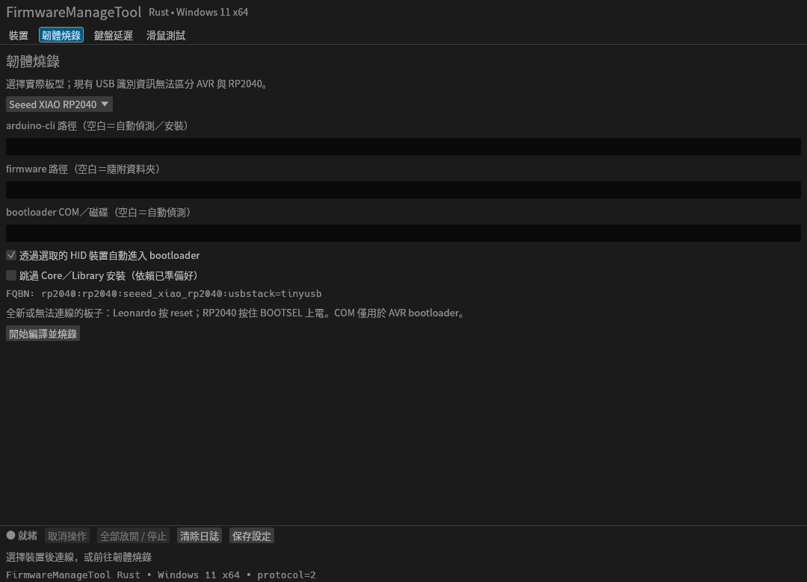

# FirmwareManageTool Rust

以 Rust 2024、egui／eframe 0.36.2 與 Wgpu 重寫的 Windows 11 x64 GUI 工具。
支援 Leonardo AVR、Seeed XIAO RP2040、Pico 及其他 arduino-pico 板型。
RP2040 使用 Vendor HID v3 二進位協定、實體 HID usage、NKRO 與七種多媒體鍵；
保留 v2 相容層。AVR 韌體與 MSCV 保持不變。

## Windows 使用

解壓可攜式 ZIP，保留 `FirmwareManageTool.exe` 旁的 `firmware` 資料夾，執行 exe。
不需要 Rust、Visual Studio 或額外的 HID driver。正式建置靜態連結 MSVC CRT。

1. 在「裝置」掃描並選取 Vendor HID，再連線。多裝置不自動取第一台。
2. 在「韌體燒錄」選實際板型，開始編譯／上傳。缺少 arduino-cli 時透過
   winget 自動安裝；Core／Library 也會按板型安裝，可選擇略過已準備的依賴。
   沒有 winget 時可自行下載 arduino-cli.exe，指定完整路徑。
3. 正常韌體沒有 COM 埠。Leonardo 只有 Caterina bootloader 使用 COM；
   無法由 HID 重啟時按實體 reset。RP2040 請按住 BOOTSEL 上電。
   可指定 bootloader COM／UF2 磁碟；多候選由 GUI 選擇。
4. 「鍵盤延遲」提供一般、高精度及可選的極限模式，並可匯出 CSV。
   測試 A 鍵，請勿操作實體鍵盤。極限量測使用獨立子程序，GUI 維持一般優先權。
5. 「滑鼠測試」包含擬人化／原始移動、拖曳、點擊、五鍵與雙軸滾輪。
   主機計算主顯示器目標／曲線並以相對滑鼠位移輸出，請先將游標放在主顯示器內。
   RP2040 3.0.3 只有一個相對滑鼠；畫面上的目標定位不使用絕對 HID。

「全部放開／停止」在工作中會取消操作並清理；閒置時直接 reset。
連線先查詢 Feature 14，自動選用 v3 或回退 v2。v3 釋放／屏障等待 USB 傳送完成，
再由 status 確認；拔線後顯示未知，重新連線建立空狀態。
v3 每 500ms 續租、租約 2 秒；v2 保留 30 秒租約與原有 ACK 語意。
RP2040 3.0.3 支援最多八個 v3 程式同時輸入，各自釋放／租約不影響其他程式按住的狀態；
STATUS 只回報自己的輸入。需重新燒錄 3.0.3；v2 可由多程式送指令，但共用同一份狀態，沒有來源隔離。詳見 [RP2040 多程式控制](firmware/boards/rp2040/README.md#多程式同時控制)。

設定、Arduino CLI 設定／依賴、sketch 工作副本及建置產物儲存在
`%LOCALAPPDATA%\FirmwareManageTool_Rust`。設定會於開始工作、保存設定及離開時保存。
首度燒錄需要網路與 winget 可用；安裝失敗會終止後續流程。

## Windows 開發與發行

以下開發指令在本專案原始碼目錄執行。

安裝 Rust stable（目前以 1.98.1 驗證）、Visual Studio Build Tools 的「Desktop
 development with C++」及 Windows SDK。於 PowerShell 執行：

```powershell
cargo run --locked
./scripts/build.ps1
```

`build.ps1` 執行 fmt、Clippy、測試與 MSVC Release 建置，然後輸出
`dist/FirmwareManageTool_Rust-0.1.0-windows-x64.zip`。
ZIP 包含 exe、韌體、文件與第三方授權資料。僅重新打包時使用 `scripts/package.ps1`。
Windows EXE 與 ZIP 僅在 Windows 原生 MSVC 環境建置及打包；建置／打包腳本會拒絕在 Linux 執行。
GitHub Actions workflow 已提供，但目前不代表已在遠端執行。

## Linux 開發檢查

```bash
cargo test --locked --workspace --no-default-features
cargo test --locked --workspace --all-targets
cargo clippy --locked --workspace --all-targets -- -D warnings
cargo fmt --all -- --check
python3 scripts/sync-input-protocol.py --check
bash scripts/test-rp2040.sh
```

Linux 可驗證純邏輯及 GUI 版面；實體 HID、量測與 bootloader 功能限定 Windows。
Linux 開發執行原始碼檢查、測試及 RP2040 韌體／UF2 編譯，不產生 Windows EXE 或 ZIP。
Linux GUI 字型使用系統 Noto CJK；Windows 使用系統 Microsoft JhengHei。

架構、期限與限制見 [docs/architecture.md](docs/architecture.md)。

Linux 離線介面預覽（尚未連接硬體）：



驗證紀錄與實機驗收清單見 [docs/validation.md](docs/validation.md)。
線路協定見 [firmware/PROTOCOL.md](firmware/PROTOCOL.md)。

## 授權

新 Rust 程式採 MIT；隨附韌體及第三方程式依原有授權。
見 [THIRD_PARTY_NOTICES.md](THIRD_PARTY_NOTICES.md)。
