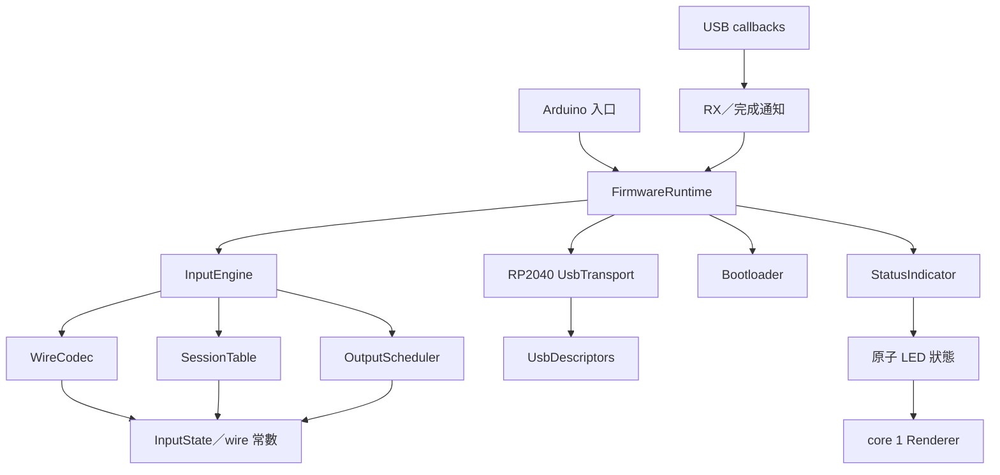

# RP2040 韌體重構規格

日期：2026-10-07。狀態：結構重構已實作並通過本機測試／板型建置；Windows／USB 實機驗收待完成。

本次只整理 RP2040 韌體結構，涵蓋同一份 sketch 的 Raspberry Pi Pico、Seeed XIAO RP2040 與既有相容板設定。
基準為 commit `8893eb5`：Vendor HID v3、韌體 3.1.0，以及管理工具的 RealTime 量測修正。
本文件記錄已確認的重構要求；實作與本機驗證結果見 [validation.md](validation.md#rp2040-結構重構)。

## 1. 問題與目標

重構前的 `firmware/boards/rp2040/Firmware.cpp` 在匿名 namespace 內按固定順序 include 多個實作標頭。
這些標頭直接建立 session、USB 物件、輸出排程及錯誤計數，並引用其他標頭先前建立的名稱。
`OutputScheduler` 直接呼叫全域 `binary::completed`／`protocolFault`，協議處理又直接操作全域 `output`。
測試透過 include 整份 `Firmware.cpp` 取得這些內部狀態。

重構必須達成下列結果：

1. 各 `.cpp` 分別編譯、正常連結，標頭可獨立 include，沒有特殊 include 順序。
2. session、排程、計數器及 bootloader 狀態有明確的持有者，沒有標頭建立的可變全域實例。
3. 協議與排程邏輯可在主機上使用同一份來源測試，無須 Arduino／TinyUSB／Pico SDK。
4. USB callback、core 0 主迴圈及 core 1 LED 工作的界線可直接從介面看出。
5. 保留既有 v3 行為、固定容量及非阻塞排程；純結構重構不引入新協議或輸入語意。

## 2. 範圍與相容性

| 項目 | 要求 |
| --- | --- |
| 韌體目標 | Pico 與 XIAO 使用同一份 RP2040 實作，以設定區分板號、LED 與 USB 識別覆寫 |
| Leonardo | 本次不遷移 AVR 實作、不改 bundled core 或 AVR 佇列配置 |
| 主機端 | 不改 MSCV、MSCV_RUST、EvanRemote 或管理工具的輸入 API／wire codec |
| USB | 保留兩個 HID 介面、現有 descriptor、VID/PID、usage、poll interval；不增加 CDC |
| 版本 | 本次純重構基準仍為 protocol=3、firmware=3.1.0、bcdDevice=0x0310；未指定新的發行版號 |
| 輸入 | NKRO、七種 Consumer、五鍵相對滑鼠、雙軸滾輪；絕對移動 opcode 持續拒絕 |
| 容量 | 8 個 session；RP2040 output／RX／TX 各 32 筆，不增加新的命令／效果佇列 |
| 建置 | arduino-pico 6.2.0、TinyUSB stack；XIAO 的驗證使用 NeoPixel 1.15.5 |

wire 定義以 [protocol-v3.md](../firmware/protocol-v3.md)、`shared/input-protocol/keys.json` 與
`vectors.json` 為準。封包、Feature 欄位與 USB descriptor 的位置／長度須保持相容。
現有文件對錯誤計數的概括敘述，應依本文第 7 節區分裝置共用計數與本 session 故障。

## 3. 來源與目錄安排

RP2040 的正式實作放在 sketch 的 `src/`，由 Arduino 分別編譯各 `.cpp`。
Arduino 官方規格明訂 `src/` 會遞迴編譯，可承載完整 sketch 來源，無須以 include 實作標頭達成編譯。
來源：[Arduino Sketch specification](https://docs.arduino.cc/arduino-cli/sketch-specification/#src-subfolder)。

建議目錄與責任如下；同一責任可調整檔名，但不得重新合併成依賴 include 順序的實作片段。

```text
firmware/boards/rp2040/
  rp2040.ino
  Firmware.h
  Firmware.cpp                    # Arduino 入口與組裝
  KeyCatalog.h                    # 按鍵表生成物
  src/
    input/
      InputState.h/.cpp           # 純資料與局部操作
      WireCodec.h/.cpp            # framing、命令／回覆、Feature 編解碼
      SessionTable.h/.cpp         # 8 個 session 的資料與查詢
      OutputScheduler.h/.cpp      # 32 筆工作、歷史來源、USB 完成處理
      InputEngine.h/.cpp          # 命令、租約、控制回覆、故障協調、TX 佇列
    platform/
      BoardConfig.h               # 常數與可覆寫板型設定
      UsbDescriptors.h/.cpp       # descriptor 的單一實例
      UsbTransport.h/.cpp         # TinyUSB／Pico RX 佇列與傳送
      UsbCallbacks.cpp            # C callback 橋接
      Bootloader.h/.cpp           # RP2040 實際重啟與延遲期限
      StatusIndicator.h/.cpp      # core 0 的 LED 狀態決策與原子發布
      StatusLedRenderer.h/.cpp    # core 1 的 NeoPixel 動畫與硬體
    runtime/
      FirmwareRuntime.h/.cpp      # 單一正式 runtime、模組協調
```

正式入口保留 `Firmware::setup/loop/setup1/loop1`，以維持現有 sketch 與工具的入口。
`Firmware.cpp` 僅組裝與委派，不能再次容納協議、排程或 LED 動畫實作。

### 3.1 與 Leonardo 共用來源的過渡

重構前 `firmware/common/*.h` 是兩板的共同來源。RP2040 遷移後：

- RP2040 `src/input/` 成為其引擎的唯一編譯來源，不再使用 `modules/V3*.h`。
- 本次保留 `firmware/common/` 與 Leonardo 的生成副本，供未遷移的 AVR 使用；兩者內容不改。
- 同步腳本繼續產生按鍵表與 wire vectors，但停止為 RP2040 產生舊引擎標頭，並移除其失去用途的副本。
- 文件須註明這是過渡狀態，不能仍宣稱 `common/` 同時是新 RP2040 引擎的唯一來源。
- 新 RP2040 與 AVR 持續共用 wire 規格及相容性測試案例。後續若修改協議／排程語意，須另列跨板遷移工作，避免只修一板。

本次不強迫 AVR 遷移，也不新增另一套會被同步腳本覆寫的 RP2040 引擎副本。

## 4. 模組介面與依賴方向



| 模組 | 持有資料 | 對其他模組的交付 |
| --- | --- | --- |
| WireCodec | 無可變裝置狀態 | 驗證後的命令、固定大小封包、Feature bytes；不執行 I/O |
| SessionTable | ID、received／completed、租約、31-byte 輸入、pending control | 查詢、來源快照及聯集；不自行發送 USB 或通知 LED |
| OutputScheduler | 工作環、歷史來源、desired／completed、in-flight 與 generation | 準備好的 HID report、完成的 session／sequence、排程故障結果 |
| InputEngine | SessionTable、OutputScheduler、TX 佇列、裝置計數及協議 boot 狀態 | 命令結果、待送回覆、故障／LED 通知、已確認的重啟請求 |
| UsbTransport | 兩個 TinyUSB HID 物件、RX 佇列、callback 通知與傳送追蹤 | 固定封包、傳送是否接受、USB completion／failure、mounted／ready |
| FirmwareRuntime | 引擎、transport、bootloader 與 indicator 的正式實例 | 驅動各階段，將平台通知轉交引擎，不重做協議判定 |

介面使用固定大小資料與明確的結果值。純引擎取得主迴圈傳入的 `uint32_t now_ms`，
不能自行呼叫 `millis()`、USB API、Pico queue API 或 LED API。
Feature 的板號／版本／裝置 ID 由初始化時提供的不可變設定組裝，不在 encoder 內讀 MCU。

Scheduler 不得回呼全域 `binary::completed` 或 `protocolFault`。
它交付完成／故障結果，由 InputEngine 更新 session 或執行清理；SessionTable 也不依賴 Scheduler。
Runtime 以具體型別協調引擎和平台，以資料交付取代隱藏的全域呼叫。
不為這次重構增加虛擬繼承、每包動態配置或新的背景工作。

### 4.1 標頭與連結規則

- 每個標頭自行 include 所需依賴，具備 include guard 或 `#pragma once`。
- `.cpp` 優先 include 自己的標頭；以正常 named namespace 定義實作。
- 禁止在 namespace／class／function 中 include 模組，也禁止 include `.cpp` 或以巨集切換實作區段。
- 非 template／非必要 inline 的函式與可變物件定義放 `.cpp`；標頭僅提供型別、宣告及適當的常數。
- 私有輔助函式可用 `.cpp` 內匿名 namespace，不能拿它包住整份跨模組標頭。
- 各 public header 可在空白 translation unit 中獨立編譯；同一標頭被兩個 `.cpp` 引用後可正常連結。
- `src/input/` 的 header／implementation 不得依賴 Arduino、TinyUSB、Pico SDK 或 NeoPixel。

## 5. 狀態所有權、啟動及核心分工

正式韌體有且只有一個 FirmwareRuntime 實例，定義在 `.cpp`，生命週期涵蓋韌體執行期間。
InputEngine 透過成員持有 session、scheduler 與 TX 狀態，不提供全域可寫引用。
測試可建立彼此獨立的 engine／runtime，不能共享靜態 session 或錯誤計數。

| 執行位置 | 可存取資料與操作 |
| --- | --- |
| core 0 主迴圈 | 命令、session、租約、排程、TX、裝置計數、boot 決策、LED 狀態決策 |
| USB callbacks | RX 複製、必要的 framing 檢查、完成／失敗通知；Feature 讀取不可變能力資料 |
| core 1 | 讀取已發布的 LED 狀態，持有動畫與 NeoPixel 物件；不讀 session／output／USB 狀態 |

啟動順序必須明確：建立純狀態與佇列、準備不可變能力資料、綁定 callback bridge，最後啟用 USB。
不得依賴不同 `.cpp` 全域建構子的先後次序；硬體動作留在 setup／begin。
core 1 的發布狀態須在其開始讀取前有效，初值維持 Off。

USB C callback 可透過一個私有、非 owning 的 active transport 指標進行橋接。
該指標只能指向正式 runtime 的 transport，不暴露引擎全域狀態；測試替換時須明確綁定／解除。
callback 尚未綁定時不能解參考未初始化物件。

callback 與主迴圈共享的 RX／完成旗標使用明確同步；LED 發布維持 release／acquire 語意。
不能以 `volatile` 取代同步，也不能假設所有 `std::atomic` 在 RP2040 都適合中斷情境，須檢查固定 Core 的實作。
RX 錯誤次數可透過同步的累計值交回主迴圈；每次 callback 原本增加的計數不能因旗標合併而遺失。

## 6. USB callback 與主迴圈契約

callback 必須維持有界工作：

- OUT 接受 id=0 含 report ID，或獨立 id=12 配 63-byte payload 的既有形式。
- report/type/length 錯誤交付 framing fault，RX 滿載交付 overflow fault；不在 callback 解析／執行輸入命令。
- 使用既有非阻塞 RX 操作及必要的短同步，不等待 endpoint、不 sleep、不重啟 MCU、不渲染 LED。
- input completion 交付 report ID 與對應的傳送追蹤；vendor completion 區分 BOOTLOADER 回覆與其他回覆。
- Feature callback 只讀能力資料，不開 session、不續租，也不排入輸出工作。

主迴圈維持目前階段順序與工作預算：

1. 依 Core 設定執行所需 TinyUSB polling。
2. 消費 callback 錯誤／通知，RX 每輪最多處理 4 筆。
3. 消費 input completion、處理 mounted／失敗／50ms 過期，推進輸出排程。
4. 檢查租約與控制完成，產生控制回覆。
5. Vendor endpoint ready 時嘗試傳送 TX 首筆。
6. 決定並發布 LED 狀態。
7. 檢查 bootloader 最終重啟條件。

通知可以在階段所屬模組消費，但不能因拆檔改變 RX／USB 完成／租約／回覆的相對判定順序。
input endpoint 每次只追蹤一筆 in-flight report，仍至少間隔 1ms；同一迴圈不補發多筆 HID report。
ready=false 時保留待送資料；send accepted 不等於 completed。
Vendor TX 只有在 transport 接受傳送後才出列，拒絕傳送時保留同一筆回覆。

斷線、USB reset 或故障清理後，舊 completion 不能推進新的 job、完成新的控制或觸發 boot。
現有 generation 語意須保留，平台與 engine 間的傳送追蹤需涵蓋失效前後的通知。

## 7. 必須保留的行為

### 7.1 封包與輸入

- OUT 12／IN 13／Feature 14；含 report ID 固定 64 bytes，payload 固定 63 bytes。
- version=3、little-endian、payload 上限 51 bytes，flags 與未用尾端必須為零。
- Feature 的 FMT3、board 1／2、按鍵／Consumer 能力、flags=23、2000ms 租約、1ms poll 與裝置 ID 不變。
- 描述子維持 NKRO id=2、Consumer id=5、相對滑鼠 id=3；沒有 id=4、v2 report 10／11 或 CDC。
- KeyId 與按鍵 bitmap 依現有表驗證；Consumer 七個位元、滑鼠位元依左／右／中／X1／X2。
- MOUSE_MOVE／WHEEL 每軸接受 ±1024，USB 相對輸出每軸拆為既有 ±127 範圍。
- 舊絕對 opcode 33、未知／非法輸入、保留位元及非法 framing 沿用現有拒絕與故障範圍。

### 7.2 多 session 與序號

- OPEN 使用非零 ID、sequence=1；相同 ID 與第九個 session 回 busy，不能覆蓋現有狀態。
- 各 session 序號獨立，所有命令均計入序號；duplicate／gap 只使所屬 session 失效。
- OPEN 不清除其他來源；持有狀態取八個 session 的位元聯集。
- SNAPSHOT 只替換自身狀態；相同鍵需所有持有者放開才輸出放開。
- RELEASE_ALL 只取消自身待送工作、釋放自身輸入，保留其他來源與自身 session 名額，可再輸入。
- 個別釋放／到期時重建其他 jobs 的歷史來源，保留其短按、位移與屏障；不能只重新套用最新聯集。
- 未知 session 的輸入丟棄；晚到心跳不能復活已到期來源。

### 7.3 排程、屏障與故障

- 輸出深度維持 32，保留同一毫秒的 down／up 與不同來源的接收順序。
- 只有符合既有條件的同來源相鄰 pending motion 可合併；不跨按鈕、snapshot 或 barrier。
- 累加每軸上限 ±8192；超限、queue overflow、最舊 job 年齡大於 50ms 沿用共用故障清理。
- BARRIER 可沿用同來源最後一筆 job 的完成 frontier；完成依 USB completion，不依提交成功。
- STATUS 的 snapshot、received／completed、pending、lease 均屬於查詢 session。
- OPEN、有效輸入、HEARTBEAT 與既有有效 RELEASE 路徑續租；STATUS／BARRIER 不續租。
- 租約在經過時間大於或等於 2000ms 時失效；主機原有每 500ms 續租方式不變。
- 非法輸入／序號／租約故障只清理該 session；USB／共用佇列故障清理全部來源並逐一產生 EVENT。
- rx／tx／hid／failsafe 保留為裝置共用 u16 wrap 計數；已釋放的閒置 session 到期仍依現有流程計數。
- 其他 session 的 failsafe 增加不能直接當成本 session 的失敗；本 session 的 EVENT／控制 timeout 仍須失敗。
- RX 同時有 framing／overflow 通知時，保留現有 framing 優先判定及故障清理流程。
- 故障後釋放優先，不補播已取消／過期的輸入。

### 7.4 Bootloader 與 LED

- 有其他 session 時 BOOTLOADER 回 busy。
- 成功重啟必須先完成輸入釋放，再完成成功回覆的 USB 傳送；以 vendor completion 起算 120ms。
- 到達重啟期限後仍需 output idle、vendor ready、TX empty；pending send、USB reset 或已失效的 completion 不能觸發重啟。
- USB serial 與 8-byte device ID 繼續來自 Pico unique ID，保留既有識別格式及板型覆寫設定。
- LED 保留 Off／Idle／Held／Error／Failsafe／Bootloader 優先順序、色彩、動畫及時間常數。
- XIAO 的 NeoPixel power/data 預設仍為 11／12，可依既有巨集覆寫；Pico 預設不啟用 NeoPixel。
- core 1 只執行 renderer；維持既有更新間隔、no-op frame 省略及 loop1 的 1ms delay。

## 8. 配置、建置與資源

協議及排程使用固定大小陣列，不新增熱路徑 heap 配置、可成長容器或動態字串。
Pico SDK 現有 queue 在初始化時的配置可保留；不能藉拆分再次建立多組 RX／TX／output。
不修改本次固定的 Core、USB stack、板型巨集及工具 FQBN。

整個 RP2040 sketch 應可由現有管理工具遞迴複製後直接編譯。
新 `.cpp` 必須在 Arduino 編譯清單中，不能依賴 repo 外 include path 或手工新增 linker 參數。
套件中的 `firmware/` 保留完整 `src/`，直接 CLI、GUI 工作副本與發行套件的來源必須一致。
本次不要求主機 EXE／ZIP；日後需要發行時仍遵守 Windows 原生建置規則。

用相同 Core／板型／設定比較重構前後 Flash、靜態 RAM 與主要呼叫路徑堆疊。
既有參考值為 Pico 85376／27492 bytes、XIAO 88192／27584 bytes（Flash／RAM），來源見
[validation.md](validation.md)。實作時先重建基準，差異須附原因與最深呼叫路徑分析，不能以仍能編譯代替資源驗收。
不在這份結構規格中新增尚無實測依據的延遲 SLA 或任意 Flash／RAM 百分比門檻。

## 9. 測試與驗收

測試分別編譯並連結正式引擎的 `.cpp`，不能 include `Firmware.cpp` 或任何其他實作檔。
Fake USB、可控制時鐘與 board reset 記錄用來模擬平台；不得另寫一份協議／排程實作作為測試替身。
行為測試優先檢查回覆 bytes、USB report 序列、完成／重啟時機，避免直接改寫私有 session／job。

| 驗收組 | 必須涵蓋 |
| --- | --- |
| 編譯邊界 | header 獨立編譯、跨兩個 TU 連結、input 不依賴板級 SDK、至少兩個 engine 狀態互不影響 |
| Wire | 現有 golden vectors、Feature bytes、descriptor bytes、兩種 callback report ID 形式、長度／padding／flags 拒絕 |
| 單來源 | NKRO／修飾鍵／Consumer、五鍵與雙軸滾輪、±1024 拆分、快速 down/up/barrier |
| 多來源 | 8 個 session、第九個／重複 OPEN、同鍵聯集、自身 snapshot／release／租約隔離、STATUS 只回自身狀態 |
| 歷史輸出 | 他人短按／位移／barrier 在釋放後保留；自身 in-flight 與他人 in-flight 的取消差異 |
| 完成 | ready=false、send 拒絕、send accepted 尚未 ACK、input／vendor completion 分流、故障前舊 completion 無效 |
| 故障 | own duplicate／gap／非法輸入、framing、RX／TX／output overflow、50ms 邊界、USB failure／reset／disconnect、u16 計數 wrap |
| 時間 | 1999／2000ms 租約邊界、STATUS／BARRIER 不續租、晚到心跳、millis wrap-around 的經過時間計算 |
| Boot | peers busy、輸入未完成、回覆未完成、ACK 後 119／120ms、失效／reset 後禁止重啟 |
| LED | core 0 狀態優先順序／期限、core 1 只讀已發布狀態、XIAO／Pico 開關配置 |
| RealTime 回歸 | GUI 舊 session 先 RELEASE 再到期，worker 繼續 down/up/barrier/status；僅舊來源有 EVENT，共用 failsafe 增加 |
| AVR 保護 | Leonardo 原有測試、編譯及生成物檢查仍通過，內容及容量不因本次遷移變動 |

保留舊 RP2040 harness 作為遷移期間的基準，使用相同命令／時間／completion 腳本比較可觀察結果。
新測試完成前不得刪除既有案例；最終移除 include `.cpp` 的 RP2040 harness，維持相同覆蓋。
比較的是 wire／USB／狀態與故障結果，不要求重構前後內部 class layout 或 ELF 完全相同。

完成實作後至少執行：

- 新 RP2040 多 TU 測試與 ASan／UBSan。
- 同步腳本 `--check`、Leonardo 測試、既有共享協議測試。
- 固定 Core 下的 Pico／XIAO 全新編譯，以及管理工具複製出來的 sketch 建置。
- Windows／實體板列舉、8-session 持有／釋放、USB 重連、bootloader 與快速按鍵驗收。
- 相同 Windows、USB 埠及背景負載下，一般／高精度／RealTime 各要求 50 輪，記錄成功、實際執行、未執行及錯誤階段。
  單一量測來源、無其他來源持有 A、不中途取消的正常環境應完成全部輪次；失敗需定位，不能改用較低成功門檻掩蓋。

主機測試與板型編譯通過可確認結構／模擬行為，實機驗收另行記錄，不能混稱已完成硬體驗證。

## 10. 實作順序與完成條件

1. 固定基準與可觀察行為：保存 descriptor／Feature、既有測試及資源用量。
2. 建立純資料、codec 與 session 型別，完成標頭／多 TU 驗證，不先改排程語意。
3. 將 scheduler 與協議處理遷入明確持有狀態的 InputEngine，解除彼此的全域回呼。
4. 接上 RP2040 transport／callback／runtime，驗證非阻塞順序、故障及 boot completion。
5. 分離 core 0 indicator 與 core 1 renderer，完成 Pico／XIAO 建置與對照測試。
6. 更新同步／建置／文件，移除 RP2040 舊實作標頭與 include `.cpp` 測試，保護 AVR 路徑。
7. 整理資源差異及實機驗收結果，列明尚未具備的驗證環境。

只有在正常 `.cpp` 連結、單一明確狀態所有權、全部既有行為測試及兩個 RP2040 板型建置皆成立後，
才可稱結構重構完成；對外實機行為仍以另外記錄的硬體驗收結果為準。
若實作發現必須改變 wire、容量、租約、故障範圍、板型識別或主機 API，需先提出具體差異並詢問使用者，
不得把該變更併入純重構。
