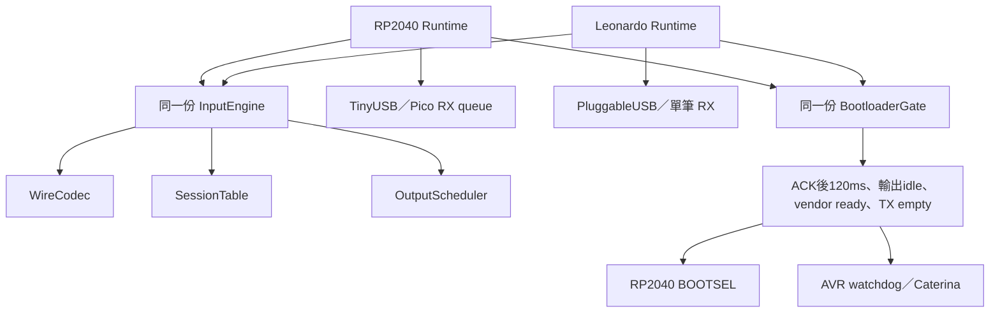

# RP2040／Leonardo 共用韌體重構

日期：2026-10-07。基準：`d9d8ef7`。兩板共用引擎已實作；本機驗證見 [validation.md](validation.md#兩板共用引擎與-leonardo-重構)。Windows／USB 實機驗收另行完成。

使用者要求：板子的 USB、同步、重啟與 LED 細節可以不同，協議及輸入實作共用。
這一階段取代原 RP2040 規格中「暫時保留 AVR 舊引擎」的過渡安排。

## 共用來源與編譯

```text
firmware/common/
  input/
    InputConfig.h                  # 固定容量與 120ms boot gate
    KeyCatalog.h                   # keys.json 生成物
    InputState.h/.cpp              # 輸入、來源合併與短暫 SourceView
    WireCodec.h/.cpp               # v3 framing、回覆與 Feature
    SessionTable.h/.cpp            # 8 個 session、序號、租約及 pending control
    OutputScheduler.h/.cpp         # 歷史來源、位移、USB completion 與屏障
    InputEngine.h/.cpp             # 命令、TX、故障、租約與 boot ACK generation
    BootloaderGate.h/.cpp          # ACK 後期限與重啟條件
  usb/
    UsbDescriptors.h/.cpp          # 相同 USB report bytes；AVR 放 PROGMEM
```

上述為唯一可編輯的共用實作。同步腳本產生兩板 `src/input/` 及 `src/platform/UsbDescriptors.*` 的副本，
每個 sketch 都完整、自足，可由管理工具遞迴複製或獨立交給 Arduino CLI。
副本是正常 `.h/.cpp`，各 `.cpp` 分別編譯，不以 include `.cpp` 或 namespace 內 include 模組組裝。
每個副本標示來源；`--check` 驗證內容、缺少來源及多餘的舊引擎檔案，生成物納入版本控制。
按鍵表維持 `shared/input-protocol/keys.json` 為資料來源；共享 wire vectors 與主機端協議不變。

純引擎不包含 Arduino／TinyUSB／Pico SDK／AVR SDK，不執行硬體 I/O 或讀取系統時鐘。
容量依建置目標選擇；未以不同平台維護兩套命令或排程分支。

| 設定 | RP2040 | Leonardo |
| --- | ---: | ---: |
| session | 8 | 8 |
| output／RX／TX | 32／32／32 | 2／1／8 |
| 租約 | 2000ms | 2000ms |
| 最舊 output 過期 | >50ms | >50ms |
| input 送出最小間隔 | 1ms | 1ms |
| 成功 boot ACK 後的共用 gate | 120ms | 120ms |

## 平台邊界與持有者

兩板 `Firmware.cpp` 都只持有單一 FirmwareRuntime 並委派 Arduino 入口。
InputEngine 持有 SessionTable、OutputScheduler、TX 與計數；Bootloader 平台 wrapper 持有共用 BootloaderGate。
平台／runtime 只處理 SDK 通知、實際傳送與重啟，不再各自解析 v3、維護 session 或重寫排程。



- RP2040：保留兩個 TinyUSB HID、Pico RX queue、callback 原子通知與 reset event hook。core 0 執行引擎，core 1 只渲染 LED。
- Leonardo：保留兩個 PluggableUSB HID、非阻塞 core packet API 與 host ACK bank 判定。interrupt OUT／control OUT 共用一筆 RX；callback／主迴圈用 AVR ATOMIC_BLOCK 交接封包與累計錯誤。
- descriptor bytes 共用；AVR 的 PROGMEM 放置是平台儲存差異。AVR Feature 在 GET_REPORT 時編碼，避免常駐 63-byte SRAM buffer。
- 身分維持 Pico unique ID／XIAO board=2 與 Leonardo 固定 HP-KB-0024／board=3；VID/PID、protocol=3、firmware=3.1.0、bcdDevice=0x0310 不變。
- AVR bundled core、endpoint 數、boot magic key／watchdog、無 CDC／無尾端 ZLP 均保留。

## 記憶體與歷史輸入

排程呼叫使用 SourceView：8 個唯讀指標，在 RP2040 為 32 bytes、AVR 為 16 bytes。
它只借用當前 SessionTable 的輸入；OutputScheduler 建立 job 時立即複製 8×31-byte 歷史值，不保存來源指標。
後續按下／放開、個別 release 或租約到期仍按歷史來源重建 peer jobs，保留短按、位移與屏障。
這取代第一階段 RP2040 每次 wrapper 的 248-byte 局部快照；不額外建立常駐 scratch buffer、heap 或 job 佇列。

TX 由引擎固定持有，只在 transport 接受傳送後出列；拒絕時保留同一筆回覆。
input 提交拒絕依原共用故障規則清理並優先釋放。各 session 的錯誤與租約只清理自己；共用 USB／queue 故障逐一產生 EVENT。
USB reset generation、排程 generation 與 boot ACK generation 交接使失效通知無法完成後續控制或觸發重啟。
BootloaderGate 在 confirmed 失效時取消期限；後續 STATUS 不覆蓋已接受的 boot ACK。
AVR 真正重啟仍由 watchdog 完成，硬體延遲與 RP2040 ROM 呼叫可以不同。

## 驗收

1. 共用原始碼可不帶板級 SDK 編譯，以 32／32／32 與 2／1／8 配置跑同一套 engine 案例。
2. 兩板 header 可獨立編譯，兩個 TU 重複引用後正常連結；不 include 正式實作 `.cpp`。
3. Pico／XIAO／Leonardo runtime 原有案例保留，與基準逐筆比較 USB bytes／順序；descriptor／Feature 使用固定 golden bytes。
4. 覆蓋八來源、短按、歷史來源、個別釋放／租約／故障、RX／TX／output 滿載、send 拒絕、USB reset／suspend／第一筆新 OUT、boot ACK／119／120ms／取消。
5. 正式來源模擬測試與 ASan／UBSan、四個 repo 的生成物同步、既有共享協議測試通過。
6. 固定 Core 下的 Leonardo／Pico／XIAO 全新建置與管理工具遞迴工作副本建置通過。
7. 記錄 AVR 的靜態 RAM、非 LTO frame 及實際 LTO frame／USB ISR 呼叫路徑，不能只以成功編譯判定 SRAM 足夠。
8. Windows／實體板的多程式、拔插、bootloader、輸入速度及三種量測模式各 50 輪另行驗收；本機測試不等於實機成功率。
